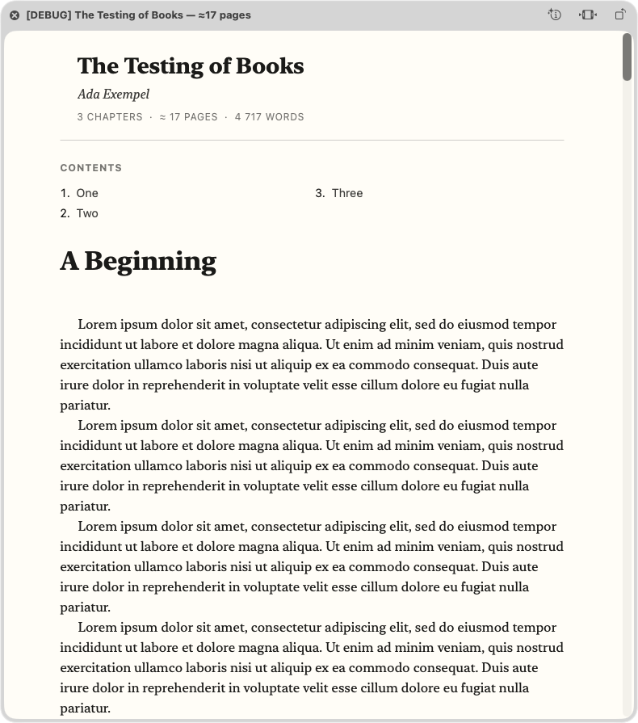

# epub-quickviewer

A lightweight native macOS EPUB viewer with a **Quick Look extension** — select
any `.epub` in Finder and press **space** to instantly see the book's cover,
metadata, estimated page count, table of contents, and full text.

Built entirely with the Command Line Tools (`swiftc`) — no Xcode, no
dependencies, no Xcode project.



## Components

| Target | Purpose |
| --- | --- |
| `EPUBPreview.appex` | Quick Look preview extension (`QLPreviewProvider`, data-based HTML reply). This is what Finder's spacebar uses. |
| `EPUB Quickviewer.app` | Minimal AppKit host app (required to register the appex). Opens EPUBs via ⌘O, drag & drop, or "Open With". |
| `epub-preview-cli` | Test harness: renders an EPUB to HTML and prints stats. |

All three share the same core (`Sources/Core/`):

- **`ZipArchive.swift`** — minimal ZIP reader (central directory +
  stored/deflate via the Compression framework). Also supports
  directory-format EPUBs (as Apple Books stores them).
- **`EPUBBook.swift`** — `container.xml` → OPF parsing (metadata, manifest,
  spine, cover), EPUB3 nav / EPUB2 NCX chapter titles, DRM detection, and
  fast UTF-8 byte-level text statistics.
- **`PreviewBuilder.swift`** — assembles one self-contained HTML page:
  header (cover, title, author, chapters / ≈pages / words), linked table of
  contents, and all chapters with images inlined as data URIs.

Page count is estimated as *(characters incl. spaces) / 1800*, the common
print-page approximation, computed over the whole book even when the rendered
preview is truncated by the text budget.

## Security posture

Book content is treated as untrusted input:

- `<script>`/`<style>` blocks, embedding tags (`iframe`, `object`, `embed`,
  `form`, …) and inline `on*` event handlers are stripped.
- URL schemes are allowlisted: only `http(s)`/`mailto`/anchor links survive;
  `javascript:`, `data:` (non-image) and cross-file links are defused.
- No network access from previews: remote images are dropped, all book
  resources are inlined as `data:` URIs.
- XML parsing has external entity resolution disabled (no XXE).
- Zip-bomb guards: 128 MiB per-entry decompression cap, 96 MiB total
  processing cap, plus text (2–8 MB) and image (24 MB) render budgets.
- Directory EPUBs are confined to the book folder (no `../` traversal).
- The Quick Look extension and the app both run App Sandboxed with
  read-only, user-selected file access, hardened runtime enabled.

## Build & install

```sh
./build.sh     # → build/EPUB Quickviewer.app (ad-hoc signed, arm64)
./install.sh   # → /Applications, registers the Quick Look extension
```

Then select an `.epub` in Finder and press space.

If you downloaded a release zip instead of building locally, clear the
quarantine flag after unzipping (the app is ad-hoc signed, not notarized):

```sh
xattr -dr com.apple.quarantine "EPUB Quickviewer.app"
mv "EPUB Quickviewer.app" /Applications/
open "/Applications/EPUB Quickviewer.app"   # launch once to register
```

If another app's preview shows instead, prioritize this one under
**System Settings → General → Login Items & Extensions → Quick Look**.

## Testing

```sh
Tests/make_sample_epub.sh sample.epub      # synthetic EPUB 3 fixture
./build/epub-preview-cli sample.epub out.html
```

Note: `qlmanage -p -o dir file.epub` crashes on macOS 26.5 for *all*
extension-based previews (Apple's included) — use `qlmanage -p file.epub`
(display mode) to test instead.

## Performance

Measured on an M2 Mac mini (cold, `-O` build):

| Book | Words | Render |
| --- | --- | --- |
| Synthetic 3-chapter sample | 4.7k | 19 ms |
| Typical novel | 123k | ~270 ms |
| Very long epic novel | 355k | ~850 ms |
